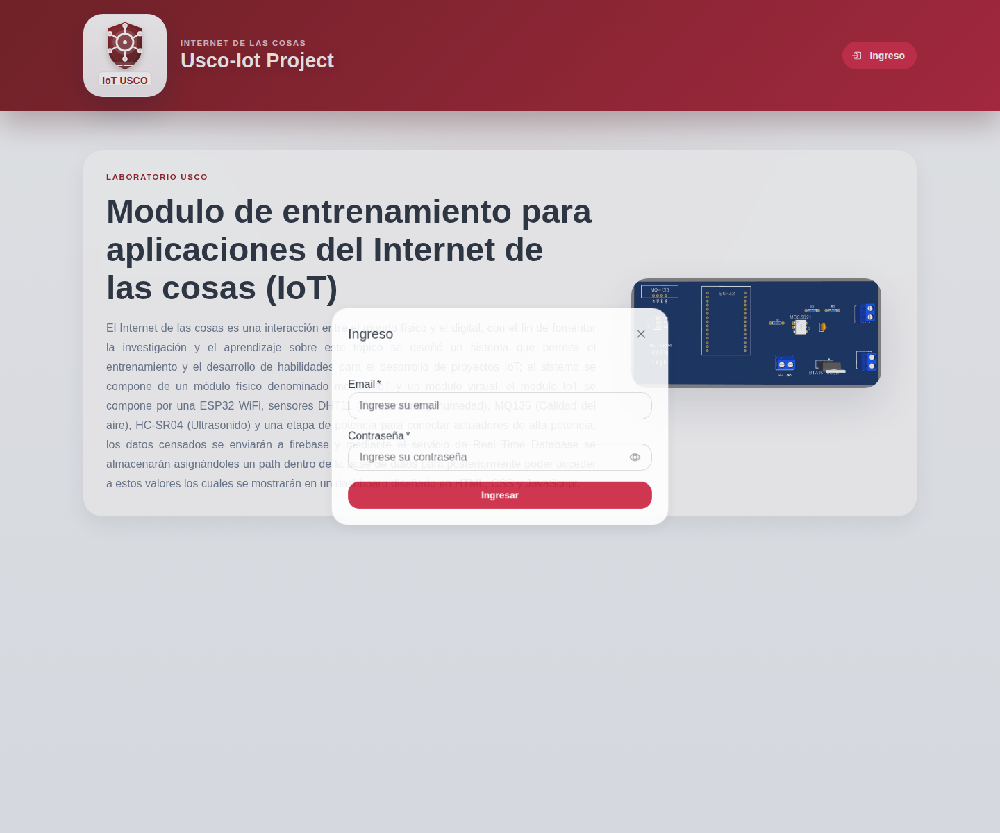
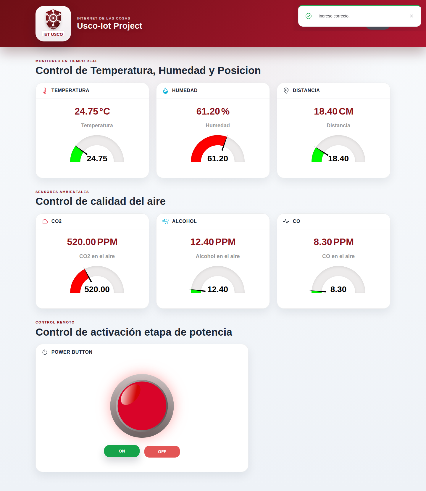
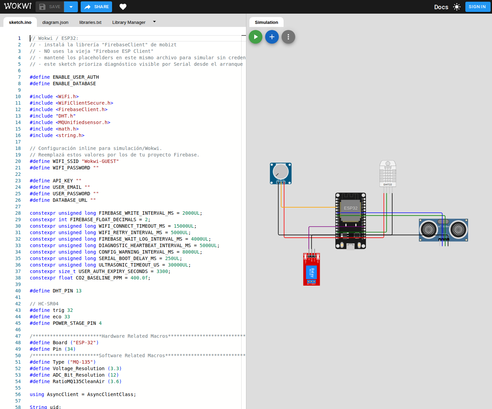

# IoT USCO Dashboard

Dashboard web + firmware de simulación para monitorear variables IoT en tiempo real con **HTML/CSS/JS vanilla**, **Firebase** y **Wokwi**.

El proyecto nació como módulo de entrenamiento para aplicaciones IoT y hoy quedó modernizado con una UI más prolija, tests automatizados y una estructura más mantenible.

## Vista rápida

### Login



### Dashboard autenticado



## Qué hace

- muestra sensores en tiempo real desde Firebase Realtime Database
- maneja autenticación con Firebase Auth
- renderiza gauges y estado de potencia desde una UI modular
- permite simular el firmware con **Wokwi** usando `FirebaseClient`

## Stack

| Capa | Tecnología |
|---|---|
| Frontend | HTML, CSS, JavaScript vanilla |
| UI | Shoelace + estilos custom |
| Backend BaaS | Firebase Auth + Realtime Database + Hosting |
| Firmware/simulación | ESP32 + FirebaseClient + Wokwi |
| Testing | Jest + Playwright |

## Quick start

### 1) Instalar dependencias

```bash
npm install
```

### 2) Configurar Firebase web

Copiá el template:

```bash
cp main/public/config.example.js main/public/config.js
```

Completá `main/public/config.js` con tu proyecto Firebase.

### 3) Levantar el frontend

```bash
python3 -m http.server 5500
```

Después abrí:

```txt
http://localhost:5500/main/public/
```

## Simulación del firmware en Wokwi

El firmware está pensado para correr en **un solo archivo `.ino`** dentro de Wokwi.

### Proyecto público en Wokwi

Podés abrir la simulación acá:

**https://wokwi.com/projects/462695057941853185**



Completá al inicio de `main/sensors.ino`:

- `WIFI_SSID`
- `WIFI_PASSWORD`
- `API_KEY`
- `USER_EMAIL`
- `USER_PASSWORD`
- `DATABASE_URL`

Para Wokwi, la red típica es:

```cpp
#define WIFI_SSID "Wokwi-GUEST"
#define WIFI_PASSWORD ""
```

## Testing

### Unit + integration

```bash
npm test
```

### Browser smoke

```bash
npm run test:e2e
```

### Regenerar capturas del README

```bash
npm run docs:screenshots
npm run docs:screenshots:wokwi
```

## Configuración sensible

Estos archivos **son locales y no se suben al repo**:

- `main/public/config.js`
- `main/credentials.h`

La variante Wokwi usa placeholders inline en `main/sensors.ino` por la restricción de archivo único.

## Estructura útil

```txt
main/public/                  # frontend
main/public/scripts/          # app modularizada
main/sensors.ino              # firmware/simulación ESP32
tests/                        # Jest + Playwright
openspec/changes/             # artefactos SDD
docs/                         # documentación y capturas
```

## Estado actual

- frontend modernizado
- firmware migrado a `FirebaseClient`
- tests Jest y Playwright disponibles
- artefactos SDD unificados en `openspec/`

## Nota

Las capturas del README se generan con el harness local de Playwright y mocks seguros del browser para no depender de credenciales reales ni subir secretos al repositorio.
